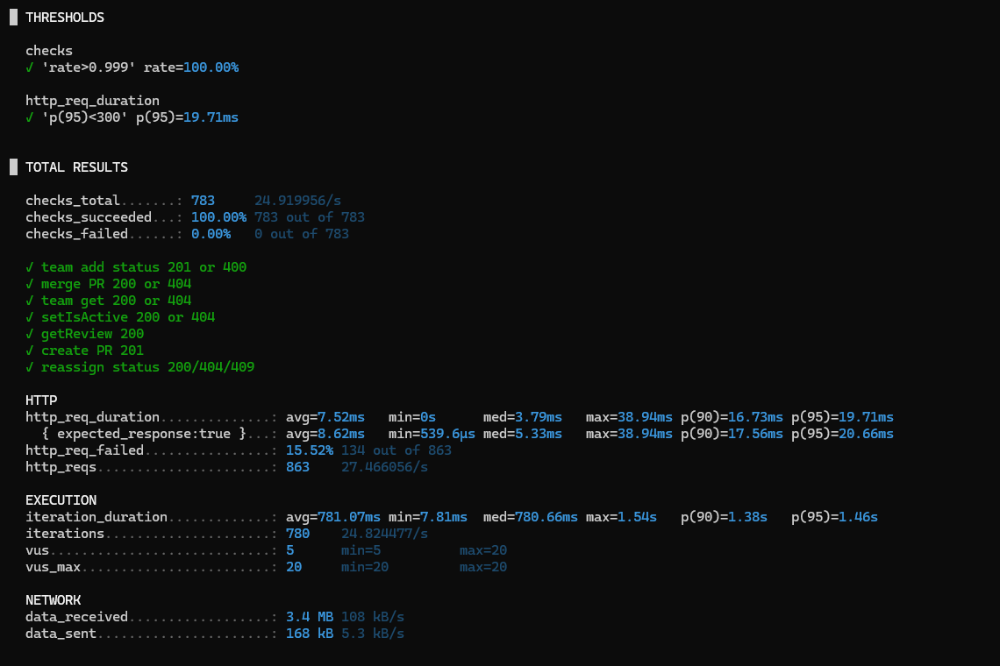

# review-assigner
Решение [тестового задания](https://github.com/avito-tech/tech-internship/blob/main/Tech%20Internships/Backend/Backend-trainee-assignment-autumn-2025/Backend-trainee-assignment-autumn-2025.md) - сервис назначения ревьюеров для Pull Request’ов
Помимо обозначенных в openapi эндпоинтнов, добавлены `/health`, `/stats/reviewers`, `/stats/pullRequests`
## Запуск
```
docker compose up -d  --build
```
## Стэк
* `golang`
* `postgresql`
* `golang echo` веб-сервер
* `migrate` для миграций
* `sqlc` для работы с sql запросами
* `oapi-codegen` для работы со схемой openapi

## Линтер
`golangci-lint`

## Нагрузочное тестирование (Grafana k6)

